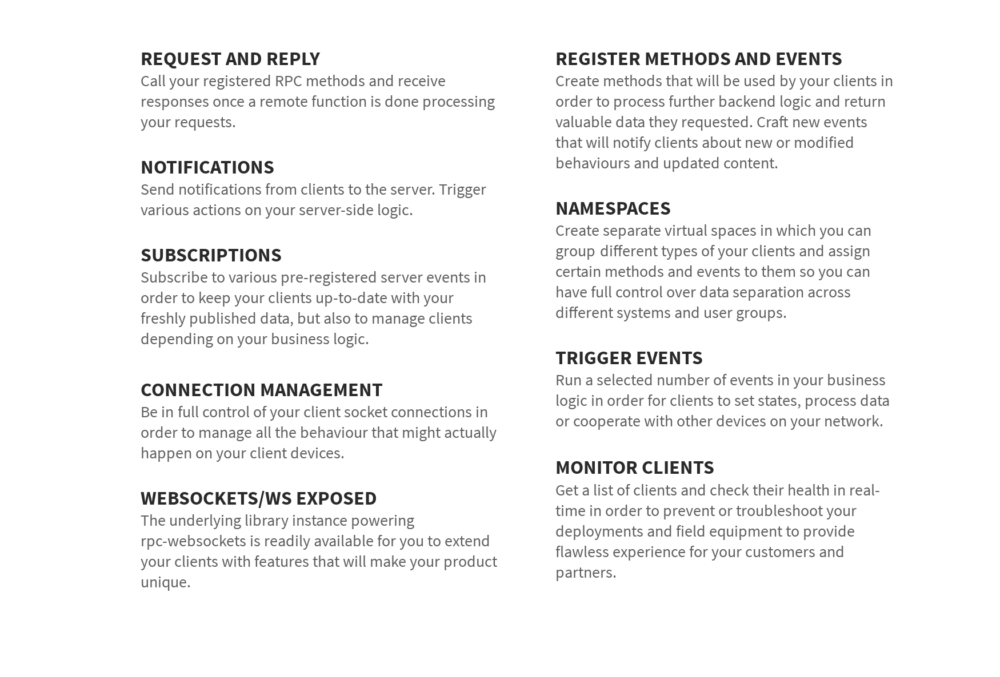

<div align="center">
  <a href="https://github.com/zo-el/msgpack-rpc-websockets">
    
  </a>
  <br>
  <p>
    WebSockets for <a href="http://nodejs.org">Node.js</a> and <a href="https://en.wikipedia.org/wiki/JavaScript">JavaScript</a>/<a href="https://en.wikipedia.org/wiki/TypeScript">TypeScript</a> with <a href="https://msgpack.org/">MessagePack</a> support on top.  </p>
  <a href="https://www.npmjs.com/package/msgpack-rpc-websockets">
                
  </a>
  <a href="https://travis-ci.org/zo-el/msgpack-rpc-websockets">
		
  </a>
  <a href="https://coveralls.io/github/zo-el/msgpack-rpc-websockets?branch=master">
		
  </a>
  <a href="https://www.npmjs.com/package/msgpack-rpc-websockets">
    
  </a>
  <br><br><br>
</div>

## About

The **msgpack-rpc-websockets** library enables developers to easily implement their business logic that includes messaging between users, machines or any devices. It provides a possibility to send and receive JSON data through the WebSocket communication protocol in order to support two-way notification push, running RPC methods and firing any types of event signalling. Only clients can call RPC methods and not vice versa at the moment. Both frontend (HTML/JS-based) and backend (Node.js-based) development environments are supported.

**msgpack-rpc-websockets** is built on Node.js and supports both LTS and Current versions.

Use the free OSS edition in order to implement and manage your own WebSocket server instances.

## Quick start

Install our OSS library in your project:
```
npm install msgpack-rpc-websockets
```

Write your source code using `msgpack-rpc-websockets`:
```js
var WebSocket = require('msgpack-rpc-websockets').Client
var WebSocketServer = require('msgpack-rpc-websockets').Server

// instantiate Server and start listening for requests
var server = new WebSocketServer({
  port: 8080,
  host: 'localhost'
})

// register an RPC method
server.register('sum', function(params) {
  return params[0] + params[1]
})

// ...and maybe a protected one also
server.register('account', function() {
  return ['confi1', 'confi2']
}).protected()

// create an event
server.event('feedUpdated')

// get events
console.log(server.eventList())

// emit an event to subscribers
server.emit('feedUpdated')

// close the server
server.close()

// instantiate Client and connect to an RPC server
var ws = new WebSocket('ws://localhost:8080')

ws.on('open', function() {
  // call an RPC method with parameters
  ws.call('sum', [5, 3]).then(function(result) {
    require('assert').equal(result, 8)
  })

  // send a notification to an RPC server
  ws.notify('openedNewsModule')

  // subscribe to receive an event
  ws.subscribe('feedUpdated')

  ws.on('feedUpdated', function() {
    updateLogic()
  })

  // unsubscribe from an event
  ws.unsubscribe('feedUpdated')

  // login your client to be able to use protected methods
  ws.login({'username': 'confi1', 'password':'foobar'}).then(function() {
    ws.call('account').then(function(result) {
      require('assert').equal(result, ['confi1', 'confi2'])
    })
  }).catch(function(error) {
    console.log('auth failed')
  })

  // close a websocket connection
  ws.close()
})
```

## Documentation

Please consult our [API documentation](API.md) for both WebSocket server and client JavaScript and TypeScript classes.

## OSS Features

Features of the free open-source edition.



All library's open-source features are documented in our [API documentation](API.md) and can be used free of charge. You are free to implement your solutions based on provided methods in any way you are comfortable with, as long as you use our work along our very permissive [license](LICENSE) conditions.

## Users

**msgpack-rpc-websockets** is being actively used in production by multiple companies in a variety of different use cases.

<br>
<a href="https://holo.host" target="_blank"></a>&emsp;

## License

This library is licensed under LGPLv3. Please see [LICENSE](LICENSE) for licensing details.
